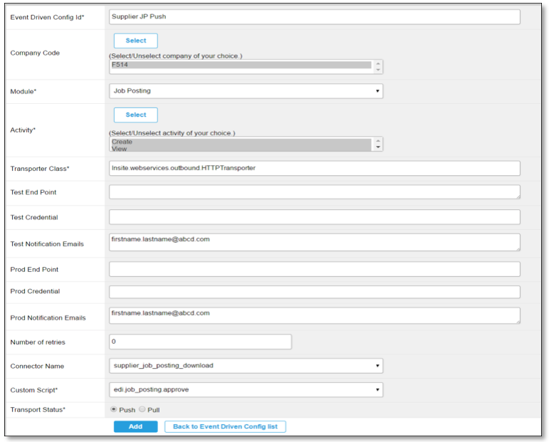

The SAP Fieldglass Connector allows you to integrate an SAP Fieldglass tenant by registering its APIs and Events.  The integration uses the [extensibility features](https://help.sap.com/viewer/0815bc232f5140bba54a58ab15c82e99/Current/en-US/9ed15aa6eac34b948693955da0c90174.html) available in the SAP C/4HANA cockpit based on concepts and solutions from the open-source project "Kyma", so that you can easily develop Side-by-Side extensions. 

> **NOTE**: The integration is possible in the **preview** mode only. Do not use it in production scenarios.

### Set up the SAP Fieldglass Connector 

1. Navigate to the **Runtimes** view under **Extensibility** in SAP C/4HANA cockpit and click on the cluster that you will be using
2. Register a new system providing an appropriate name (e.g. 'fieldglass')
3. Click **Kyma Console**.
4. In the Console, choose the Namespace, go to **Catalog** and select **[Preview] SAP Fieldglass - Connector**.
5. Click **Add once** to install and configure the SAP Fieldglass Connector:

    | Parameter            | Description                                                                     |
    | -------------------- | ------------------------------------------------------------------------------- |
    | **Application Name** | The name of the registered system from step 2.                                  |
    | **Cluster Domain**   | The domain of the Kyma cluster. For example, `demo.cluster.extend.cx.cloud.sap` |
    | **Password**         | The password for API and Event authentication                                   |
    | **System URL**       | The URL of your SAP Callidus ICM tenant. For example `https://tenant.fgvms.com` |
    | **Username**         | The username for API and Event authentication                                   |
    | **x-ApplicationKey** | Server-provided key for calling Fieldglass APIs                                 |

### Set up the SAP Fieldglass Event Driven Configuration
1. On the SA page under Integration Tools, select Event Driven Config.
2. Click New.
3. Select and/or enter the values as shown in the following screen capture and table.  
5. Click Add

    | Parameter           | Description                                                                                                                     |
    | ------------------- | ------------------------------------------------------------------------------------------------------------------------------- |
    | **Prod End Point**  | The kyma endpoint to receive the events. For example `https://fgeventgateway-namespace.demo.cluster.extend.cx.cloud.sap/events` |
    | **Prod Credential** | Base64 encoded credentials - should be the same used for API authenication                                                      |

